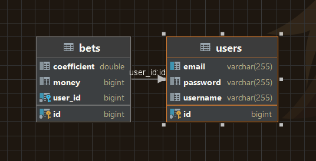

# Simple Place a Bet App 🎲🎰🍀

## List of Contents

- [Description](#description)
- [Technologies](#technologies)
- [SOLID](#solid)
- [DTO](#dto)
- [DAO](#dao)
- [Testing](#testing)
- [Logging](#logging)
- [Own Part of realization of Google Guice](#own-part-of-realization-of-google-guice)
- [Features](#features)
- [Usage](#usage)
- [Database](#database)
- [Author Info](#author-info)

---

## Description

### Preview, I hope you enjoy it 😊

Welcome to Simple Place a Bet App, a project designed to place a bet authorization user.
Main gain of this project is realize Dependency Injection, and this was realized.
This project is built using Java 11, Hibernate 6, MySQL Driver.
All technologies you can see in the part of this README.md under the heading [Technologies](#technologies).

---

## Technologies

- `Hibernate 6`
- `MySQL Driver`
- `Log4j2`
- `JUnit 5`
- `lombok`

---

## S.O.L.I.D.
☑️ `Single responsibility principle` - A class should have only one reason to change.

☑️ `Open/Closed principle` - Software entities (classes, modules, functions, etc.) should be open for extension, but closed for modification.

☑️ `Liskov Substitution Principle` - Child classes should never break the parent class type definitions.

☑️ `Interface Segregation Principle` - No client should be forced to depend on methods it does not use.

☑️ `Dependency inversion principle` - High-level modules should not depend on low-level modules. Both should depend on abstractions. Abstractions should not depend upon details. Details should depend upon abstractions.

## DTO
☑️ `DTOs`, or `Data Transfer Objects`, are objects that carry data between different parts of your application.

## DAO
☑️ `DAOs`, or `Data Access Objects`, are responsible for abstracting the interaction with a database or other data storage mechanism.They provide an interface for performing CRUD (Create, Read, Update, Delete) operations on data entities.
___

## Testing

☑️ I used `TDD` , or `Test-Driven Development` principle when I develop this application. The system is tested using `JUnit 5` to ensure its functionality and reliability. 
___

## Logging

☑️ `Log4j2` is employed to provide logging (levels: `info`, `warn`, `error`).

---

## Own Part of realization of Google Guice
This is a short realization a `Dependency Injection` or `DI`. U can check realization
in package `lib` there place the 2 annotations and one realization.<br>
Annotations:
- `@Inject` - mark the fields that should be injected. Annotation can be applied to field class declarations. The annotation's information should be retained at runtime.<br>
- `@Component` - mark classes as components that should be managed. Annotation can be applied to class declarations. The annotation's information should be retained at runtime.<br>
Realization place in `Injector`.

___

## Features

- ✅️ Auth in app:
    - ✅️ Authorization;
    - ✅️ Registration;
      <br><br>
- ✅️ Main app:
    - ✅ ️ Menu navigation (console);
    - ✅️ Place a bet;
    - ✅️ Show all list bet for current user;
- ✅️ Dependency Injection:
    - ✅️ Inject field class;
<br><br>
---

## Usage

1. I would you recommended to clone my project from the GitHub.
   <br> If you wanna do this please use this command:

```md  
git clone https://github.com/dima666Sik/
```
2. To run this project you will need to install:
    - JDK 11 or higher;
    - MySQL RDBMS.

3. If you have downloaded a project and want to run it with your own database then you have to change .properties file which will be
   stored in this way `src/main/java/resouces/hibernate.properties` and put your valid data please.

```properties
# Configuration (Data source)
hibernate.driver_class=com.mysql.cj.jdbc.Driver
# Origin database
hibernate.connection.url=jdbc:<rdbms>://<domain>:<port>/<nameDB>
hibernate.connection.username=<username>
hibernate.connection.password=<password>

# Configuration (Hibernate)
hibernate.dialect=org.hibernate.dialect.MySQLDialect
hibernate.show_sql=true
hibernate.current_session_context_class=thread
hibernate.hbm2ddl.auto=update
```
4. If u want u can use the implementation `DI` 
in your project, if you need to change/add some classes 
that should be Injected you can change this data here.
```java
public class Injector {
    private static final Map<Class<?>, Class<?>> ifaceClassMap = new HashMap<>();
    private static final Set<Class<?>> classSet = new HashSet<>();
    
    static {
        ifaceClassMap.put(AuthorizationService.class, AuthorizationServiceImpl.class);
        ifaceClassMap.put(BetService.class, BetServiceImpl.class);
        ifaceClassMap.put(UserDAO.class, UserDAOImpl.class);
        ifaceClassMap.put(BetDAO.class, BetDAOImpl.class);

        classSet.add(AuthorizationController.class);
        classSet.add(BetController.class);
        classSet.add(MenuController.class);
    }
    
}
```

5. Here are the steps for you to follow:
    - Add this project to your IDE as `Maven` project.
    - If necessary, configure `Java SDK 11` in `Project Structure settings`.
    - You can change setting to your logging into `log4j2.properties`.
    - First, you will need to register as a new user.

---

## Database

- You need to create database and add properties to `hibernate.properties`, and this all that u must to do in order to start
  to using this project.
  <br><i><b>Visually it looks like this:</b></i><br>
  

---

## Author Info

- [Linkedin](https://www.linkedin.com)

- [GitHub](https://github.com/dima666Sik)

[Back To The Top](#description)